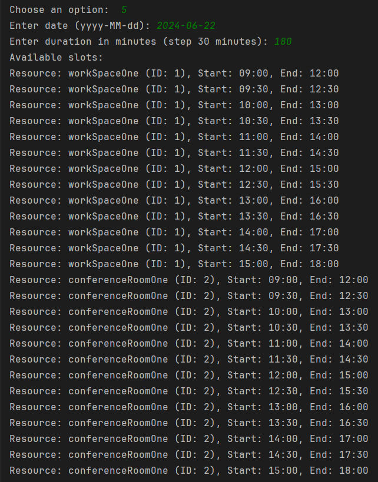
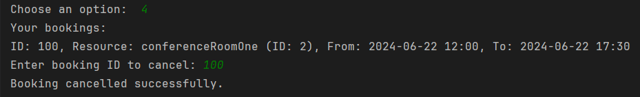

## [ДЗ №1](https://github.com/EvgenyBayandin/YlabCourse/tree/homeWorkOne)

# Coworking-Service
Разработайте приложение для управления коворкинг-пространством. Приложение должно позволять пользователям бронировать рабочие места, конференц-залы, а также управлять бронированиями и просматривать доступность ресурсов.

# Функциональные требования:
- регистрация и авторизация пользователя;
- просмотр списка всех доступных рабочих мест и конференц-залов;
- просмотр доступных слотов для бронирования на конкретную дату;
- бронирование рабочего места или конференц-зала на определённое время и дату;
- отмена бронирования;
- добавление новых рабочих мест и конференц-залов, а также управление существующими;
- просмотр всех бронирований и их фильтрация по дате, пользователю или ресурсу.

# Технические требования:
- приложение должно быть написано на Java;
- приложение должно быть консольным;
- приложение должно быть написано на pure java (без использования spring), данные хранятся в коллекциях (в памяти);
- реализуйте CRUD (Create, Read, Update, Delete) операции для управления бронированиями и ресурсами;
- реализуйте авторизацию и аутентификацию пользователей;
- реализуйте обработку конфликтов бронирований;
- unit-тесты, покрытие 75% (junit5 + Mockit + assertJ).

# Запуск приложения:
1. Необходимо запустить главный класс CoworkingServiceApp;
2. Выберите пункт меню 1 - login;
3. Введите имя пользователя и пароль администратора (имя "a", пароль "a");

4. Выберите раздел "Admin menu" для создания ресурсов;

5. Выберите 1 пункт, затем тип помещения, название и вместительность;

6. Повторите шаги 4 и 5 для всех необходимых типов помещений;

7. Для просмотра доступных к бронированию помещений, выберите пункт 2 в меню администратора;

8. Для выхода в главное меню выберите 7;

9. Создайте нового пользователя, выберите пункт 2 в главном меню;

10. Авторизуйтесь под именем созданного пользователя, выберите пункт 1;

11. Для просмотра сводобных слотов выберите пункт 5 и укажите дату и длительность брони с шагом 30 минут;

12. Для создания брони, выберите пункт 2, укажите дату и время начала и окочания брони, затем выберите доступное помещение;

13. Посмотреть ваши брони можно выбрав пункт 3;

14. Для выбора бронировани по имени пользователя, типу помещения или дате бронирования, выберите пункт 6;

15. Для удаления бронирования выберите пункт 4;

16. Чтобы изменить параметры помещения, выберите пункт 3 в меню администратора;

17. Для удаления ресурса, используйте пунтк 4 в меню администратора;

18. Для остановки приложения выберите logout и затем Exit;

19. Создать бронь на занятый слот и помещения нельзя;

